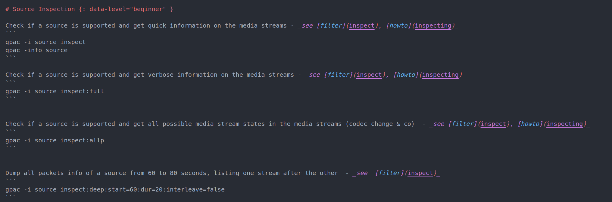
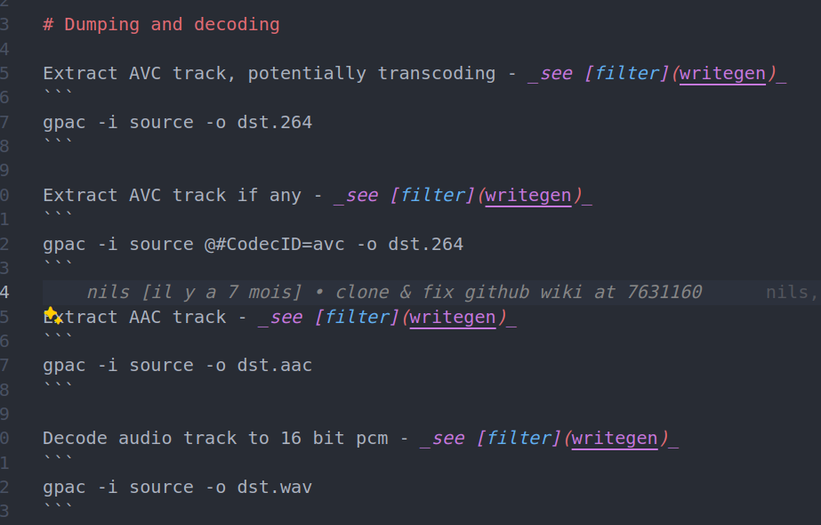
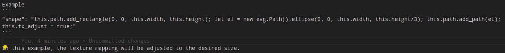
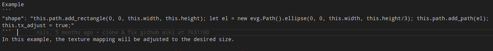

# GPAC Wiki Content Tagging and Level Switch System

## Overview

The GPAC wiki implements a content tagging and level switch system to provide a customized reading experience for users with different levels of expertise. This system allows users to toggle between "Beginner" and "Expert" modes, affecting the visibility of content sections and keywords displayed.

## Purpose

The main goals of this system are:
1. To help users new to GPAC access simpler, more approachable content.
2. To provide more in-depth, technical content for experienced users.
3. To create a dynamic reading experience that adapts to the user's knowledge level.

## Implementation

### Content Tagging


Content tagging is implemented in Markdown files using the `attr_list` extension. Tags are applied to H1 headers (single `#` in Markdown) using the following syntax:

```markdown
# Section Title {: data-level="beginner" }
```

Available levels:
- `beginner`: Content suitable for newcomers to GPAC.
- If not specified: More advanced content (considered as expert level).
  
### Level Switch

The level switch is a toggle located in the "Settings" menu in the header of the user interface. It allows users to switch between "Beginner" and "Expert" modes.

Default setting: The default level is set to "Expert", displaying all documentation.

User preference storage: The selected level is stored in the browser's local storage, persisting between sessions.


## Functionality

### Content Visibility

When switching between levels:

. Expert mode:
   - All sections are visible (in Howtos).
   - The full Table of Contents (TOC) is displayed, including all sections and subsections.
   - For filter options: all options are dispalyed.

2. Beginner mode:
   - Only sections tagged as "beginner" are visible (in Howtos).
   - Sections not explicitly tagged as "beginner" disappear(in Howtos).
   - For filter options: options with the attribute `id="vsize" data-level="basic"` will be visible in beginner mode.


Example:



Beginner mode: Only sections tagged as "beginner" are visible.



Expert mode: All sections are visible.

### Keywords Cloud

The keywords cloud is dynamic and changes based on the selected level:

- In Expert mode: All keywords are displayed.
- In Beginner mode: Only keywords tagged as "beginner" or "all" are shown.

Keywords are defined in the `data/keywords.json` file with the following structure:

```json
{
  "KEYWORD": {
    "description": "Keyword description",
    "level": "beginner"
  }
}
```

When a user clicks on a keyword, a modal appears with the keyword's definition.

## Implementation Details

### Key Files

- `javascripts/levels.js`: Main logic for level switching and content filtering.
- `javascripts/domManipulation.js`: Handles DOM manipulation for showing/hiding content.

### Howtos Section

The level switching functionality is currently implemented only in the "Howtos" section of the documentation.


## Developer Guidelines

1. Tagging new content:
   - Always tag H1 headers in Markdown files.
   - Use the format: `# Title {: data-level="level" }` where `level` is "beginner".

   - Untagged sections are considered "expert" by default.

2. Adding new keywords:
   - Add new keywords to the `data/keywords.json` file.
   - Include a description and appropriate level tag.

3. Testing:
   - Test new content in both Beginner and Expert modes to ensure proper visibility.
   - Verify that the TOC updates correctly when switching levels.
   - Check that the keywords cloud updates appropriately.

## Best Practices for Content Formatting

When adding or editing content in the GPAC wiki, it's crucial to follow certain formatting practices to ensure readability and proper rendering of the documentation. One key aspect to pay attention to is the spacing between code blocks and other elements.

### Spacing Between Code Blocks

Always add a blank line between code blocks and surrounding text. This practice prevents rendering issues and improves readability.

#### Good Practice:

Example:



#### Bad Practice:

Avoid this:
Example:




