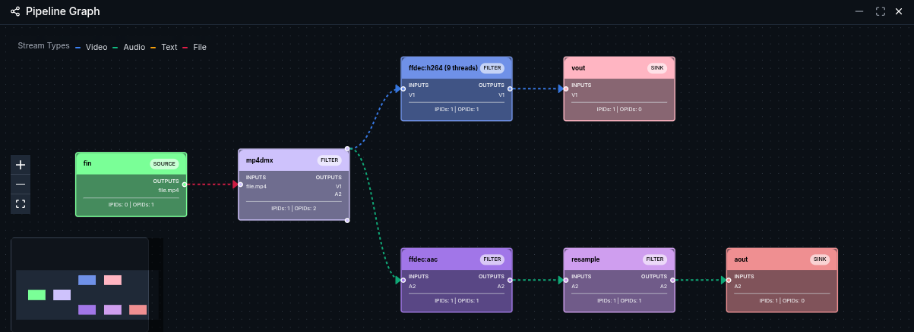
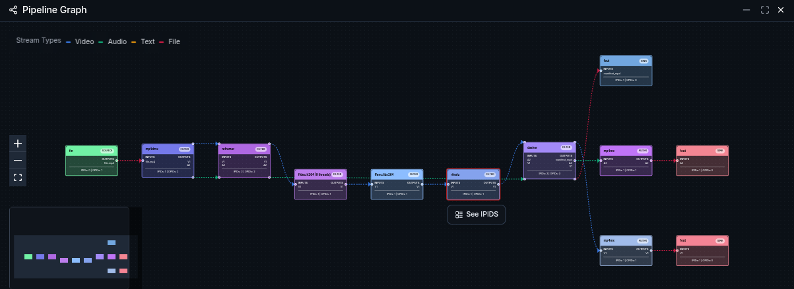
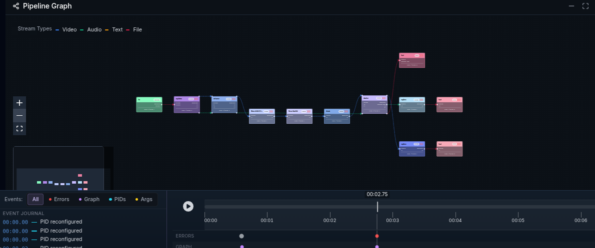
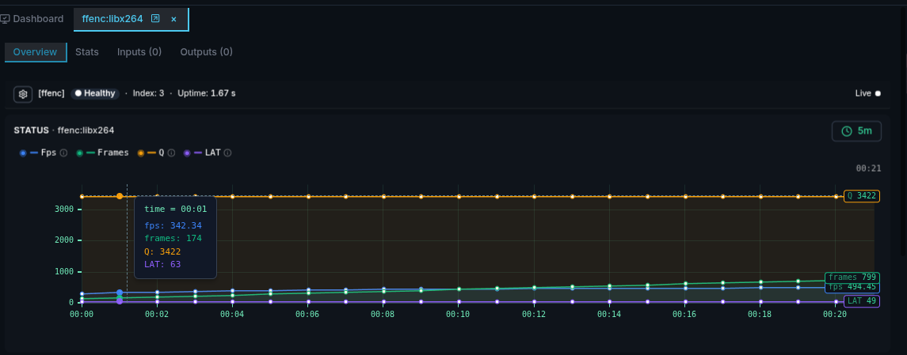
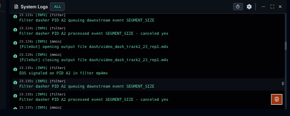
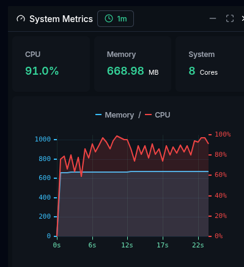

---
tags:
- rmt
- monitor
- websocket
- session
- filter
- graph
- pid
- log
- metrics
- dash
- recording
- pipeline
- option
- data
- source
- sink
---

# Introduction {:data-level="all"}

GPAC provides a remote monitoring system for inspecting a running filter session.
Remote monitoring is enabled using the `-rmt` option. Once enabled, the GPAC session exposes monitoring information through a WebSocket server.

The session can then be inspected using the monitoring interface available at: https://monitor.gpac.io
The monitoring application connects directly to the running GPAC instance and does not store monitoring data on a remote server.

The same interface is also distributed with GPAC and can be opened locally from
`GPAC_ROOT_DIR/share/scripts/rmt/index.html`.

This article explains how to monitor a running GPAC session and how to record monitoring data for later inspection.

# Overview {:data-level="all"}

GPAC remote monitoring supports two main use cases:

- Live monitoring, using `-rmt`, to inspect a GPAC session while it is running.
- Session recording, using `-rmt-log=/path/to/MySessionLog`, to save monitoring logs and inspect the session afterwards.

During live monitoring, the interface provides information about the running filter session, including:

- the filter graph
- filters and PIDs
- session metrics
- GPAC logs
- graphical representations of collected metrics

A recorded monitoring session contains the monitoring logs collected during execution. It can later be loaded into the monitoring interface for offline inspection and replay.

For more advanced use cases, the `-rmt-path` option specifies the path to a different JavaScript backend for the RMT WebSocket server, for example to test another version of the monitoring backend.

For more information on customizing the remote monitoring backend, see the [WebSocket monitoring](../Developers/tutorials/rmtws/) developer documentation.

The following sections show how to start and record remote monitoring sessions.

# Live monitoring {:data-level="all"}

To enable remote monitoring, add the `-rmt` option to the GPAC command line.

The monitoring interface can then connect to the running GPAC session and display the filter graph, filters, PIDs, logs and session metrics in real time.

A simple way to start is to monitor a playback session:

```bash
gpac -i file.mp4 vout aout -rmt
```

This opens the input file, sends the video to the video output and the audio to the audio output.

Once the session is running, open https://monitor.gpac.io and select the local connection preset (defaults to ws://localhost:6363). This uses the default -rmt port, so no manual configuration is needed.

The filter graph displayed in the monitoring interface reflects the processing chain created by GPAC for this command.



Each node in the graph corresponds to a filter of the running session, making it easier to inspect more complex processing pipelines.

To illustrate a more complex processing workflow, the following example transcodes the input to AVC with a target bitrate of 1 Mbit/s and packages it as DASH with 2 second segments:
```bash
gpac -i file.mp4 reframer:rt=on c=avc:b=1m -o dash/test.mpd:segdur=2 -rmt
```



The monitoring interface can then be used to inspect the filters involved in the encoding and packaging pipeline, their PIDs, logs and runtime metrics.

# Session recording {:data-level="all"}

To record a monitoring session for later inspection, add the option `-rmt-log=<path-to-logs>`.
```bash
gpac -i file.mp4 vout aout -rmt -rmt-log=MySessionLog
```

This starts the same live monitoring session as before and additionally records it under `MySessionLog/`. Each recording is stored in a timestamped subdirectory.

Recorded sessions can be loaded directly from a local session directory, or remotely through a WebSocket connection to a GPAC instance.



# Monitoring interface {:data-level="all"}

The monitoring interface provides several widgets for inspecting the running session.

## Pipeline Graph

The Pipeline Graph displays the filter graph and the connections between filters.

## Session Filters

The Session Filters widget provides an overview of the filters in the session, including their processing activity and status.

Selecting a filter opens a detailed view with its statistics, inputs and outputs.



## System Logs

The System Logs widget displays GPAC logs during execution. It can be used to inspect messages, warnings and errors produced by the running session.



## System Metrics

The System Metrics widget displays system resource usage, including CPU and memory, with graphical representations of the collected metrics.



## Timeline and Event Journal

When inspecting a recorded session, a timeline is shown at the bottom of the interface. It lets
you play, pause and scrub through the recorded session, and zoom in and out on a specific time
range.
